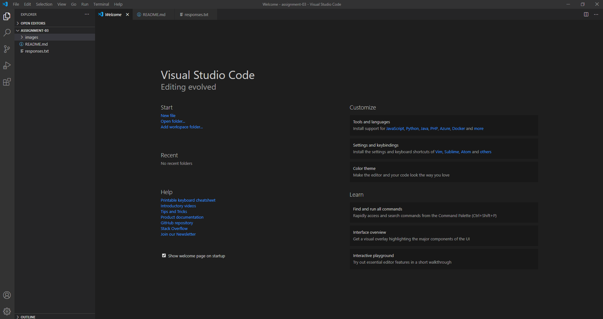

# Assignment 3
## Beau Goldberg

3 Things I've Learned So Far
- Many of the intricacies of the internet were new information to me. I had a decent overview of how 
  things worked but not to the detail presented in the videos
- Working directly inside of a folder in a editor such as Visula Studio Code is new to me. I think it is 
  cool that you can work straight out of that folder instead of having to drag and drop all the files into 
  the directory
- I thought it was cool that there was such a vast network of underwater cables spanning the earth connecting 
  all of the different continents. I was unaware of exactly how many cables there were over the world, it is 
  pretty mind-blowing.

1. [Amazon](https://www.amazon.com)
2. [Response File](../assignment-03/responses.txt)
3. 