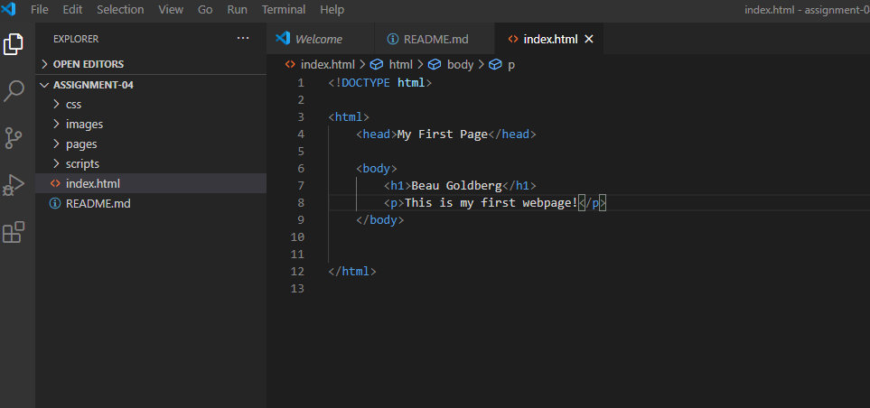

# Homework 4 README

1. Browsers function by using software to take in and display instruction files for the user to see. Then process and renders the UI as the user interacts with the website.
   I currently use mostly microsoft edge just out of habit but also have google chrome.

2. A Markup language is a language that can be used to construct and design a webpage in a given format. HTML is the most common markup language in development.

3. 