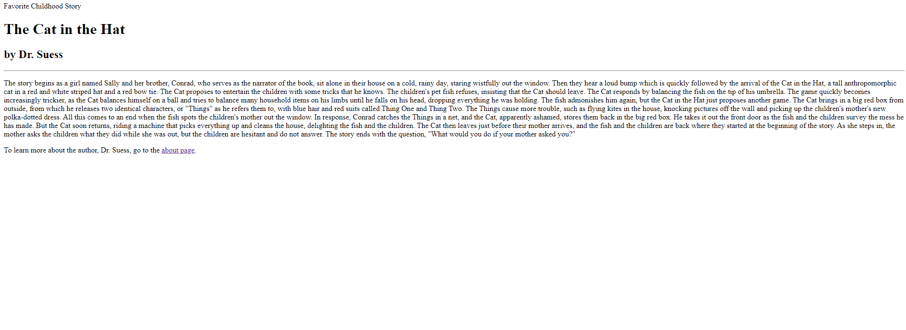

# Homework 5 

1.) In the Wayback Machine I went to the UMT website back in 2009. Immediatly you could tell the 
    lack of functionality compared the website today as well as the lack of style and formatting.
    the menus seems to be lacking functionality and the pages were very localized with no real 
    style added to them. It looked very basic and to the point.

2.) By the last few topic im assuming it is meant just the overall material we have been covering in the
    last few homeworks. It was very helpful to have a tutorial on how to use Github Desktop correctly as
    I was never introduced to it properly. I think its almost a neccesary skill to have going into the 
    workforce and im excited to become better at using Git and its tools. I feel I have a good overall
    grasp of the components of an HTML sheet and how they work together so I am looking forward to 
    developing more skills and being able to make bigger and better webpages!

3.)